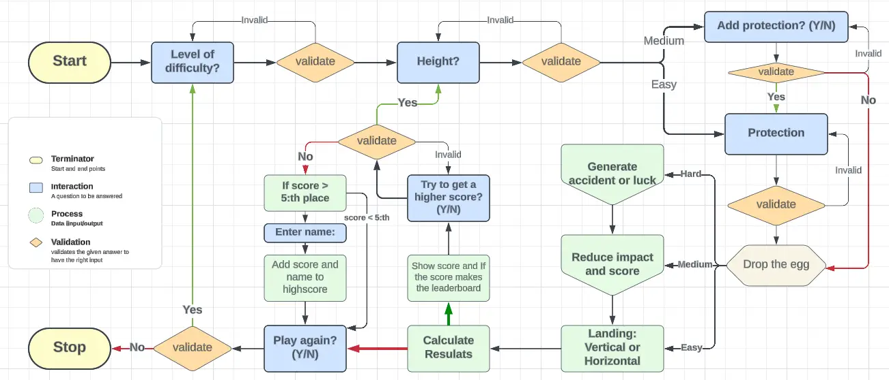
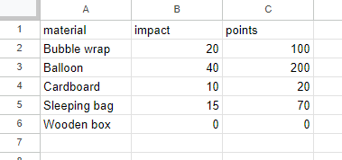
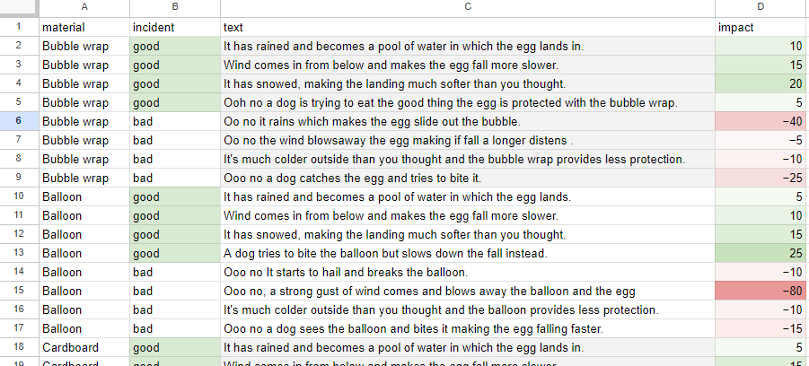
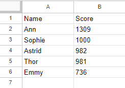
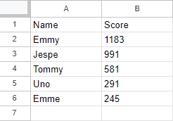
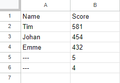

# **Save the Egg**
**PICTURE** 
 
"Save the Egg" is a Python command line interface (CLI) game. The main objective of the game is to earn as many points as possible by dropping the egg from as high as possible without breaking it. To protect the egg from breaking, the user can use different materials. The game features three levels, each increasing in difficulty to make it less predictable. 

View the live application here: [Save the Egg](https://savetheegg-09d1666a8257.herokuapp.com/)

Google Sheets Materials, Incident (Level: Hard), Leaderboard - easy, medium, hard (view only) [here](https://docs.google.com/spreadsheets/d/1SLiWQUgkEJjnfCm5Y_rsjwojI7-m6nipCWDagON4oKk/edit?usp=sharing).

## Content
* [**User Experience/User Interface (UX/UI)**](#user-experienceuser-interface-uxui)
  * [User Goals](#user-goals)
  * [User Stories](#user-stories)
* [**Creation process**](#creation-process)
  * [Project Planning](#project-planning)
  * [Flowchart](#flowchart)
  * [Google API SetUp](#google-api-setup)
  * [Logic](#logic)
  * [Google Sheets](#Google-sheets)
  * [Design Choices](#design-choices)
* [**Features**](#features)
  * [How to play Save the egg](#how-play-use-Save-the-egg)
  * [Future Features](#future-features)
* [**Technologies Used**](#technologies-used)
* [**Libraries & Packages**](#libraries--packages)
* [**Testing**](#testing)
* [**Deployment**](#creation--deployment)
* [**Credits**](#credits) 
 

# User Experience/User Interface (UX/UI)

## User Goals
"Save the Egg" is created for the user as a fun game to test the forcelimit of a egg. The game is shown in a Command Line Interface and the leaderboard is stored in a secure Google Sheet. This are some ponits that i have focust on when making this project

  - It must be easy to navigate and to understand the rules the first time the user read them
  - An engaging UI to capture the user's interest.
  - Clear instructions for entering data correctly are provided.
  - No dead ends to trap the user at the end of a function.

## User Stories

# Creation process
## Project Planning
## Flowchart
To help structre the project, Lucidchart was use to create a flowchat over the game and the main functions needed.

## Google API SetUp
## Logic
## Google Sheets
I created a Google Sheets document to storage the materials that can be used to protect an egg and their consequences on harder levels of a game. The document also contains the events that can occur on the hardest level. In addition, there's a leaderboard for the three difficulty levels where users can enter their names if they achieve a high score. The document is only editable by me, but you can view it using the link I provided. **[here](https://docs.google.com/spreadsheets/d/1SLiWQUgkEJjnfCm5Y_rsjwojI7-m6nipCWDagON4oKk/edit?usp=sharing)**

### Materials
On this sheet contains the materials the user can chose from and the diffrenc of the impact is does on the egg. 

### Incidents
Shown below are the incidents that can occure. The incidents depent on the meterials the user have chosen to use. To see all the incidents click in the lick to the view over the whole google sheet.

### Highscores
|Easy|Medium|Hard|
|----|-----|----|
||||

## Design Choices
# Feature
## Future Features
- The user can see the leaderboard for the diffrent levels before starting the game.
# Technologies Used

# Libraries & Packages
Some of the importations have only one functionen been imported this is to make the program more efficent seen i only use one function in the libraries. 
   - **google.oauth.service_account**   
  This libary is used to acess the
   - **gspread**  
  This was imported and used its functionality to smoothly add, remove and manipulate data in the linked Google Sheets spreadsheets.
 
   - **Pandas** 
   Pandas has been used to make it easy to handle the data from the worksheet and to present it in the user interface.

   - **Numpy**  
   This libary was used to esaly substact and add values to avode using for-loops.
   Since numpy is used to handle vectors and matrices, reorganising some of the data is accomplished with more efficient code. 

   - **radint, from random**   
   This function was used to generate an integer corresponding to the event or position of the egg when it lands. This makes the player less predictable, even at a lower level.
   - **system, from os**  
   This is used to clear the terminal of text, making it easier for the user to follow the game.
   - **sleep, from time**  
   Used to allow the user time to read the text on the screen before it is cleared.
   - **Design** 
   The libarys/functions was used to make the design of the game more appyling and intresting.
      - **_pyfiglet_**  
      Used for ASCII art text in the Start and the end of the game
      - **_Fore and Style, from colorama_**  
      Used to give the user a visual feedback of the input and results in the game. Makes the text in the terminal brighter and the UI more appealing.
      - **_get_terminal_size, from shutil_**  
      To make the text in the termial in the ceter of the interface. 

# Testing
I have created an additional file for manual testing and validation. You can find it here: **[TESTING](/TESTING.md)**

# Deployment
 
# Credits
