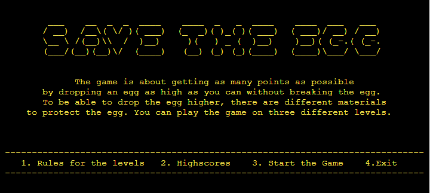
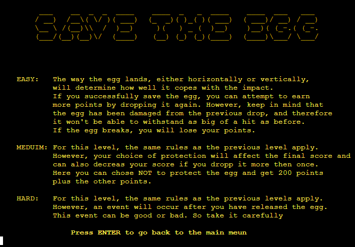
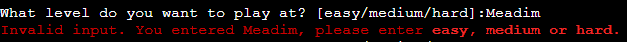
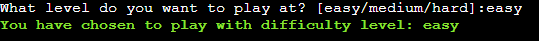
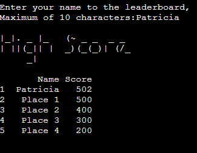

# **Save the Egg**
 
  
"Save the Egg" is a Python command line interface (CLI) game. The main objective of the game is to earn as many points as possible by dropping the egg from as high as possible without breaking it. To protect the egg from breaking, the user can use different materials. The game features three levels, each increasing in difficulty to make it less predictable. 

View the live application here: [Save the Egg](https://savetheegg-09d1666a8257.herokuapp.com/)

Google Sheets Materials, Incident (Level: Hard), Leaderboard - easy, medium, hard (view only) [here](https://docs.google.com/spreadsheets/d/1SLiWQUgkEJjnfCm5Y_rsjwojI7-m6nipCWDagON4oKk/edit?usp=sharing).

## Content
* [**User Experience/User Interface (UX/UI)**](#user-experienceuser-interface-uxui)
  * [User Goals](#user-goals)
  * [User Stories](#user-stories)
* [**Creation process**](#creation-process)
  * [Project Planning](#project-planning)
  * [Flowchart](#flowchart)
  * [Logic](#logic)
  * [Google Sheets](#Google-sheets)
  * [Design Choices](#design-choices)
* [**Features**](#features)
  * [How to play Save the egg](#how-play-use-Save-the-egg)
  * [Future Features](#future-features)
* [**Technologies Used**](#technologies-used)
* [**Packages and Libraries**](#packages-and-libraries)
* [**Testing**](#testing)
* [**Deployment**](#creation--deployment)
* [**Credits**](#credits) 
 

# User Experience/User Interface (UX/UI)

## User Goals
"Save the Egg" is designed as a fun game for the user to test the force limit of an egg. The game is displayed in a command line interface and the 5 highest scores is stored in a secure Google Sheet. These are some of the points I focused on when creating this project

  - It must be easy to navigate and to understand the rules the first time the user read them
  - An engaging UI to capture the user's interest.
  - Clear instructions for entering data correctly are provided.
  - No dead ends to trap the user at the end of a function.

## User Stories
1. As a User, i want the explanation and the rules of the game to be clear and easy to understand.
2. As a User, i want some pysichs to be behind the game
3. As a User, i want to be able to enter low numbers then 1 m for droping the egg
4. As a User, i want to be enganged in the game
5. As a User, i want the game to be harder and less pedictibel at higher levels

# Creation process
## Project Planning
When planning this project, I wanted to create a game based on my knowledge of physics. To begin with, the whole game was supposed to be as physically correct as possible. Unfortunately, the calculations of the material force reduction became too complex, so the force reduction was estimated with the help of Wikipedia. The same goes for the events in the hardest level, but some of the events are designed in such a way that the user will fail no matter what height the user chooses to drop the egg from.

To structure the coding I made a flowchart using Lucischart. The flowchart is also used to see which inputs need to be validated to keep the game from crashing.

To make the game more interesting, there is also a highscore list for the three different levels. As a user, you can only enter a name if you have enough points. 

I decided to use Google Sheets to store the leaderboards for the different levels and also to store the materials to protect the egg and the different incidents that can happen when playing the game on the most difficult level. 

## Flowchart
To help structre the project, Lucidchart was use to create a flowchat over the game and the main functions needed.

## Logic
### Physics
For this game, I wanted it to follow some of the physics rules. To find a formula to calculate the force the egg is exposed to, some assumptions are made.  To start with, we need to know the speed of the egg before it hits the ground. To find this velocity the assumption is made that there is no wind resistance no matter what the shape of the egg or the shape after the egg is protected. This means that the energy is conserved and will be the same just before the egg hits the ground as it is when the egg is released, leading to 
$$mgh = {mv_i^2\over2} \quad \Longrightarrow  \quad v_i = \sqrt{2gh} \ .$$

The force to which the egg is subjected depends on the sum of all the forces over time. This is also an impulse, which can be seen as the momentum the egg has before the collision ( $\vec{p_i}$ ) and after the collision ( $\vec{p_f}$ ).
$$\vec{I} = \vec{\Delta{p}}=\vec{p_f}-\vec{p_i}=m(\vec{v_f}-\vec{v_i}) .$$

Here we assume that the collision is elastic, meaning that no energy is lost through heat. We also assume that the egg does not bounce off the ground, which means that $v_f=0$. This leads to
$$F= {I \over \Delta{t}}={mv_i\over \Delta{t}}.$$

For simplicity, I also assume that the collision time is equal to   
$$\Delta{t}={distance \over velocity} = {h_{egg} \over v_i} \ . $$

This results in the collision force being 
$$F = {2mgh \over h_{egg}} \ . $$

As you can see, there are a lot of assumptions involved, which leads to further complexity if the force reduction for the materials is to be calculated correctly. 

The force that can be applied to the egg before it breaks is taken from a YouTube video, see [Cedits](#credits).

By allowing the user to be able to drop the egg more than once, two important functions are added to make the game more challenging. The first removes the protective material from the list that the user has already used, and the second reduces the egg's force limit depending on the amount of force in the impact it has already taken. 

-------------------------------------------------------------------

### Python
I started this project by setting up the connection to the API and Google Sheets. After that I thought it was important to have validation functions that were as universal as possible. This was achieved by using the try/except statement.

To make the flow of the program as good as possible, I started by making the main function of the game (level easy). To make the game more fun and interesting, a leaderboard of the top 5 scores is created. This was done using classes and the information was stored in a google sheet. The Google Sheet was also used to store information about protection and incidents for the hard level.

After the result the user can make the decision to try to increase the score by risking the current score, this only happens if the egg does not brake. This is achieved by using the IF statement.

To manipulate the egg limit, Numpy is used to avoid for-loops. Numpy is also used to rotate the display of the data.

## Google Sheets
I created a Google Sheets document to storage the materials that can be used to protect an egg and their consequences on harder levels of a game. The document also contains the events that can occur on the hardest level. In addition, there's a leaderboard for the three difficulty levels where users can enter their names if they achieve a high score. The document is only editable by me, but you can view it using the link I provided. **[here](https://docs.google.com/spreadsheets/d/1SLiWQUgkEJjnfCm5Y_rsjwojI7-m6nipCWDagON4oKk/edit?usp=sharing)**

### Materials
On this sheet contains the materials the user can chose from and the diffrenc of the impact is does on the egg. 

### Incidents
Shown below are the incidents that can occure. The incidents depent on the meterials the user have chosen to use. To see all the incidents click in the lick to the view over the whole google sheet.

### Highscores
|Easy|Medium|Hard|
|:----:|:-----:|:---:|
||||

## Design Choices
The Colorama Python library was used to create a bright, appealing interface and to give the user some form of feedback on their input. As the library is limited to 8 colours, the Format Style is also used for this.

If the user enters an incorrect value, the text is coloured red and an informative text explains why the input was not accepted. If the input is correct, the text is displayed in green. The user's response is also displayed. The text for invalid and valid input is displayed in BRIGHT to make the text more noticeable.

In the programme, the text is WHITE or YELLOW to represent the egg white and yolk, in addition to the text explaining why the egg is whole or broken after the drop that is LIGHTCYAN_EX.

### Egg ASCII art
To make the game more appealing, I wanted to show a whole egg or a broken egg depending on the result, unfortunately I had a hard time finding ASCII art, so I decided to make my own, which can be seen below. The ASCIIart has made by placing a image as a background and then follow the image with symboles. Where the images are taken are cedited in [Credits](#credits).

    
Whole egg

    
    

  

    
Broken egg

    
    

 

# Feature
### Start menu
As an opening screen, the user is greeted by the name of the game in ASCII art and a menu where the user can choose to read more about the rules for the different levels, see the high score boards, start the game or quit the game. As long as the user is in the menu, the text is YELLOW to make it easy for the user to see that the game has not yet started. 

#### Rulse For the diffrent level 

    
Rulse for the different levels featurs

    

#### High Scores

    
High Scores features

    

---------------------------------------------------------

### Inputs
When the game starts, all the questions are white and the valid answers are colour coded. The wrong answer is red and the correct answer is green. This allows the user to understand whether the feedback is negative or positive in a simple and clever way. 

    
Invalid

    
    

    
Valid

    
    

### Resulte
After the user drops the egg, they are first shown a text saying "Dropping the egg..." to build suspense. After two seconds, a whole and broken egg is shown, along with a text explaining why the egg broke or survived.  If the egg survives, the user can see the score they got, along with information on whether they made the leaderboard or not, and if they made the leaderboard, their placement number.

Players have the option to drop the egg again and risk their current score, adding an element of excitement to the game.

  
Easy and Medium

  

In the 

  
Hard

  
  

### Highscore
After a user have entered their name to be place in the leaderboard the user gets pressented with the highscore to be able to see the resten of the scores.

### End Title
When the user has finished playing the game, they will see a message thanking them for playing the game and informing them that they can press `RUN PROGRAM` to restart the game.

## Future Features
- Add the weight of the protection to the calculation
- Ask if the right answer is provided even if the input is valided
- Add the option for the user to play the game on diffrent planet

# Technologies Used
- **HTML, CSS, Javascript**  
Was provided by the temple made by the Cod Institute for this project focusing on Python code.
- **Python** 
The game was achieved through using Python.
- **Gitpod**  
Used as a workspace to create the program.
- **GitHub**  
The source code is hosted on GitHub and deployed using Git Pages.
- **Git**  
During the development of the website, Git was utilized to commit and push code.
- **Lucidchart** 
Used to create the flowchart of the project.
- **Google Sheets worhsheets** 
Used to save the highscores on the leaderboard and the materiales usable to protect the egg. As well as the incidints that can occure on the hardest level.
- **Google cloud console** 
It is used to provide an API connection between the Python code and the worksheet in Google Sheets.
- **Heroku** 
Was used to deploy the project.

# Packages and Libraries
Some of the imports have only one function imported, this is to make the programme more efficient, seen I only use one function in the libraries. 
- **google.oauth.service_account**   
 Used this library to authenticate access to the Google APIs, facilitating the connection between the service account and the credentials function. We then created a CREDS.json file containing the necessary details for API access to my Google account, where the Google Sheets spreadsheet containing the needed data. Cred.json is not commited in to github since it containing secret data.
- **gspread**  
This was imported and used its functionality to smoothly add, remove and manipulate data in the linked Google Sheets spreadsheets.
- **Pandas** 
Pandas has been used to make it easy to handle the data from the worksheet and to present it in the user interface.
- **Numpy**  
This library was used to replace, substitute and add values to avoid using for loops.
Since Numpy is used to handle vectors and matrices, the reorganisation of some of the data is done with more efficient code. 
- **radint, from random**   
This function was used to generate an integer corresponding to the event or position of the egg when it lands. This makes the player less predictable, even at a lower level.
- **system, from os**  
This is used to clear the terminal of text, making it easier for the user to follow the game.
- **sleep, from time**  
Used to allow the user time to read the text on the screen before it is cleared.
- **Design** 
The libarys/functions was used to make the design of the game more appyling and intresting.
  - **_pyfiglet_**  
  Used for ASCII art text in the Start and the end of the game
  - **_Fore and Style, from colorama_**  
  Used to give the user a visual feedback of the input and results in the game. Makes the text in the terminal brighter and the UI more appealing.
  - **_get_terminal_size, from shutil_**  
  To make the text in the termial in the ceter of the interface. 

# Testing
I have created an additional file for manual testing and validation. You can find it here: **[TESTING](/TESTING.md)**

# Deployment
### Deploying to Heroku
This project was deployed following the steps below:

1. Log in to Heroku 
2. Click "New" to create a new app. Placed on the upper right side and then select "Create new app".
3. Choose an app name and region region, then click "Create app".
4. Go to "Settings", navigate to Config Vars and click on "Reveal Config Vars". 
Add the following config variables: 

      |KEY|VALUE|
      |:-------------:|:---------:|
      |PORT      |8000             |
      |CRED      |Take the text in the **cred.json** an paste it|

5. While remaining in 'Settings', Go down to Buildpacks and click on **Add buildpack**
One at a time, choose the **Python** pack and click 'Add Buildpack', then choose the **NodeJS** buildpack and click 'Add Buildpack'.  
**IMPORTEN: the Python buildpack must be above the NodeJS buildpack.**
6. Navigate to "Deploy".  
Set the 'Deployment method* to Github and enter repository name and click 'Search'. 
If the right repository is showing click 'Connect'.
7.  Scroll down to Manual Deploy, select "main" branch and click "Deploy Branch". 

The app will now be deployed to heroku

-------

### Forking the GitHub Repository
By forking the GitHub Repository we make a copy of the original repository on our GitHub account to view and/or make changes without affecting the original repository by using the following steps...

1. Log in to GitHub and locate the [GitHub Repository](https://github.com/Ko11e/Save_the_egg)
2. At the top-right corner of the Repository, locate the "**Fork**" Button. Click on the button to make a fork of this repository
3. You should now have a copy of the original repository in your GitHub account.
  
-----  

### Clone this GitHub Repository

A local clone of this repository can be made on GitHub. Please follow the below steps:

1. Log in to GitHub and locate the [GitHub Repository](https://github.com/Ko11e/Save_the_egg)
2. Above the repository file section, locate the '**Code**' button.
3. Click on this button and choose your clone method from HTTPS, SSH or GitHub CLI, copy the URL to your clipboard by clicking the '**Copy**' button.
4. Open your Git Bash Terminal.
5. Change the current working directory to the location where you want the cloned directory.
6. Type `git clone`, and then paste the URL you copied earlier. 
7. Press **Enter** to create your local clone.
 
 

# Credits
## Content References
- **Code Institute's 'Love Sandwiches'** - The step-by-step instructions from the walkthrough project were used to set up the Google Sheets API and credentials.
- **[Pandas](https://pandas.pydata.org/docs/reference/api/pandas.DataFrame.html)** - To find the right function to sort or get data in the libary pandas.
- **[Colorama](https://pypi.org/project/colorama/)** - Used to understand the colours that can be used to make the UI more appealing. 
- **Stockoverflow, W3schools and Geeks for Geeks** - Code and solutions to bugs that appear under the project was fuonde using Stockoverflow, W3schools and Geeks for Geeks. 

## Media
#### **ASCII art**
The images I used as a template to create the ASCII art are taken from:
  - Whole egg - [BBC page](https://www.bbc.com/news/newsbeat-47127298)
  - Brooken egg - [Alamy, photo stock](https://www.alamy.com/stock-photo/broken-egg-isolated-vector-illustration.html?sortBy=relevant)

#### **Youtube** 
  - **_Fore Guy_**   
  To find the force limit for a egg [Force Guy](https://www.youtube.com/watch?v=kVv-gTJeJUY) uses a hydraulic press. "Force Guy" makes two tests for each direction and therefore the average is taken from these values.
  - **_Classes_**  
  To understand more about classes i watched the playlist from _Corey Schafer_ [_Python OOP_](https://www.youtube.com/watch?v=ZDa-Z5JzLYM&list=PL-osiE80TeTsqhIuOqKhwlXsIBIdSeYtc) and the video provided by Code Institute [_Exploring Python Classes with Ben Kavanagh_](https://www.youtube.com/watch?v=opOK_1g1rsw&list=PL_7334VduOHvzZYlgy_0kZLcic2NINCUt&index=7).

## Acknowledgements  
- Thanks to Amy Richardson, who helped with inperation and advice for the README.
- Thanks to my former classmate who helped with the physics calculations and even the more complex ones that are not in the project.
- Thanks to my family, who tested the programme and helped me make up for the hard level.
- Thanks to my mentor Gareth McGirr for his support and guidance.
- Thanks and appreciation to my classmates at the Code Institute students who gave great support, ideas and feedback.

 

**[Back to the top](#save-the-egg)**