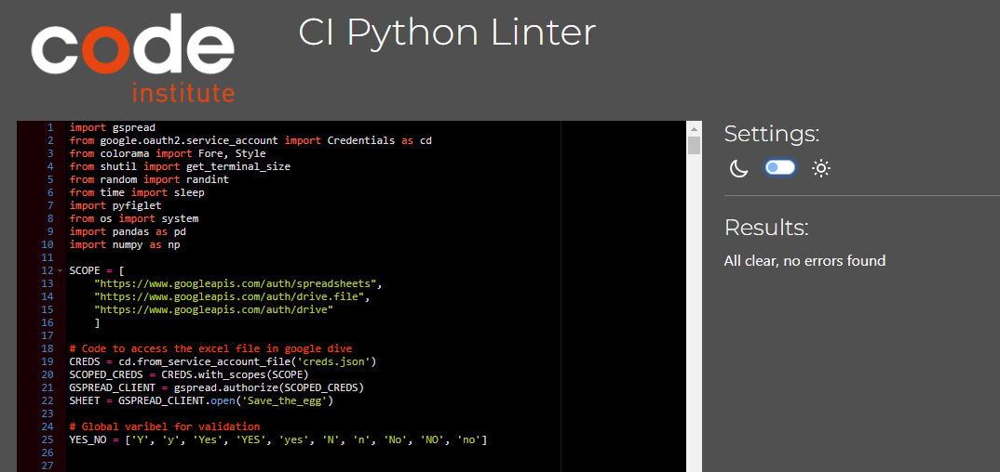

# Testing of Save the egg

## Content
**[Validation](#validation)**  
**[Manual Testing](#manual-testing)** 
**[Bugs](#bugs)**

## Validation

### PEP8
The code have been validated using Code Institute's PEP8 Linter. No errors were found in the last validation test, se result below:
 
### Lighthouse

## Manual Testing
Below are the manual tests that have been made.
## Validations

## Calculations

## Bugs
### Fixed Bugs

|Bug           |Solution             |
|:----|:-----|
|The function validation_number does not run validation_int if a list is provided | the wrong if statment was used. Where `lst != None` was use first and found truogh stackoverflow that iss should be `lst is not None`|
|Getting the wrong value from the data.  Exempel Sleepingbag was chosen and Woodenbox was selected. | The wrong function was used `.iloc` was replaced with `.loc`|
|If the impact value becomes negative due to a low height drop and good protection. The egg force limit will increase rather than decrease. |By having a if statment, checking if the value of the total impact is negative. If the value is negative no calculations is made and the force limit remain the same.       |
|If the incident, on hard level, was bad the value retrieved from the Google sheet was a string insted of a integer.|By checking the retrieved value if it is a string and then remaking it into an integer. This bug/solution to the bug made it easier to print the occurrence of the text in green or red.|

### Unfixed Bugs
No know bugs found

--------------------

[Return to main README](/README.md)