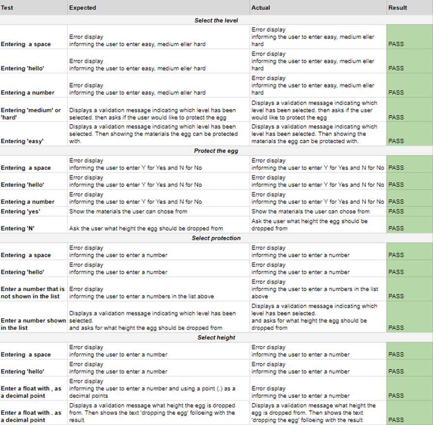
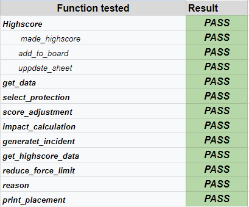

# Testing of Save the egg

## Content
**[Validation](#validation)**  
**[Manual Testing](#manual-testing)** 
**[Bugs](#bugs)**

## Validation
### PEP8
The code have been validated using Code Institute's PEP8 Linter. No errors were found in the last validation test, se result below:
 

## Manual Testing
### User Stories 

  1. As a User, i want the explanation and the rules of the game to be clear and easy to understand.
  
    - At the start of the game there are clear instructions of the game.
    - By pressing 1 or 2 in the start menu the user can read more about the differcultes and the highscores of the levels

  2. As a user, I want to be provided with clear instructions throughout the main menu and game.

    - All sections requiring user input are signposted with clear instructions on how to proceed
    - User is prompted and instructed when invalid information is entered

  3. As a User, I want to be able to navigate back to the Main Menu.

    - By presing ENTER the user will return to main menu

  4. As a User, i want to be enganged in the game

    - Colorama library used to produce text with engaging colours and meaning and makeing ASCII art more appyling.
        - GREEN for valid input and good intcedent for hard level
        - RED for invalid input and bad incedent for hard level
        - CYAN for the users attention to be drawn to important information
        - YELLOW for the main menu and when a user gets first place
    - Having a Highscore board to push engang the user to want a higher score

  5. As a User, i want the game to be harder and less pedictibel at higher levels
    
    - From easy to medium points will be redust depending on the merteral
       - The user has the chose to protect the egg or not, but resev 200 point if the egg survives
    - From medum to hard 
       - A incident can occure which can be good or bad

### Function Testing
#### Validation
  
The remaining questions have the same validation function, which means that their test is not documented.

#### Calculations
I have tested functions by printing their output and verifying the results manually. Additionally, all the randomly generated events were printed and cross-checked manually in the Google Sheets worksheet. Below is the list of all the tested functions. 

## Bugs
### Fixed Bugs

|Bug           |Solution             |
|:----|:-----|
|The function validation_number does not run validation_int if a list is provided | the wrong if statment was used. Where `lst != None` was use first and found truogh stackoverflow that it should be `lst is not None`|
|Getting the wrong value from the data.  Exempel Sleepingbag was chosen and Woodenbox was selected. | The wrong function was used `.iloc` was replaced with `.loc`|
|If the impact value becomes negative due to a low height drop and good protection. The egg force limit will increase rather than decrease. |By having a if statment, checking if the value of the total impact is negative. If the value is negative no calculations is made and the force limit remain the same.       |
|If the incident, on hard level, was bad the value retrieved from the Google sheet was a string insted of a integer.|By checking the retrieved value if it is a string and then remaking it into an integer. This bug/solution to the bug made it easier to print the occurrence of the text in green or red.|
|When enter a name to add to the highscore it only add en five characters with out there being any restriction in the code|When "self.names" and "self.scores" were changed from a `numpy.array` to a `list`, the bug disappeared. However, there is now a 10 character restriction for user input. When entering their name, users will be notified of a 10 character limit for input.|

### Unfixed Bugs
No know bugs found

--------------------

[Return to main README](/README.md)